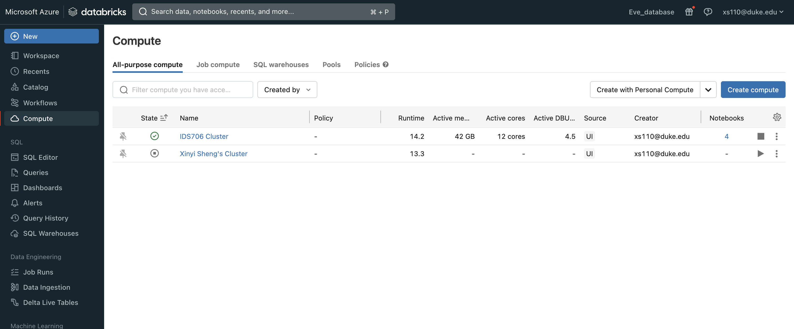
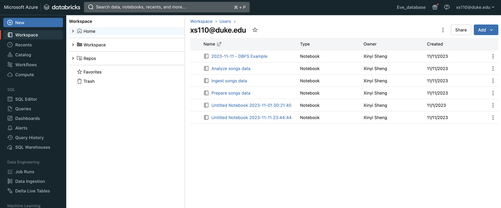
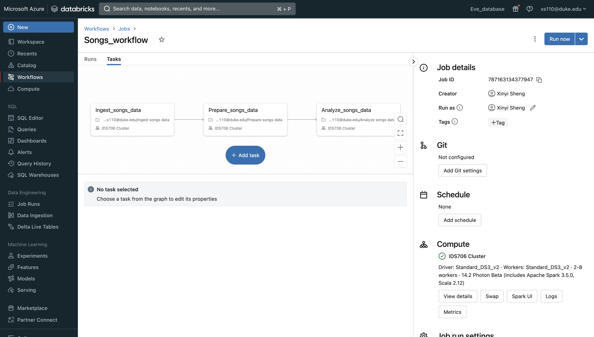
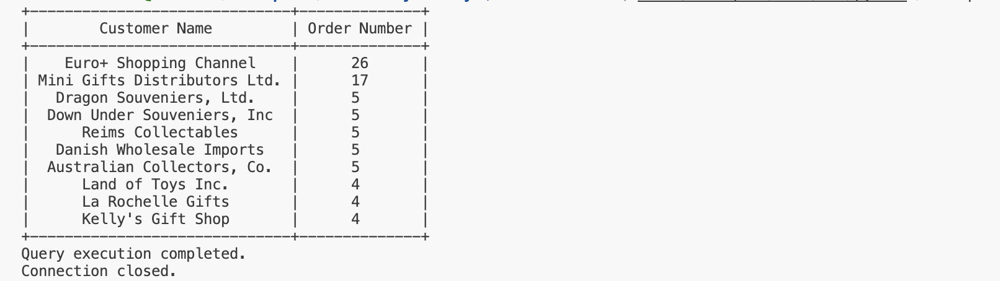
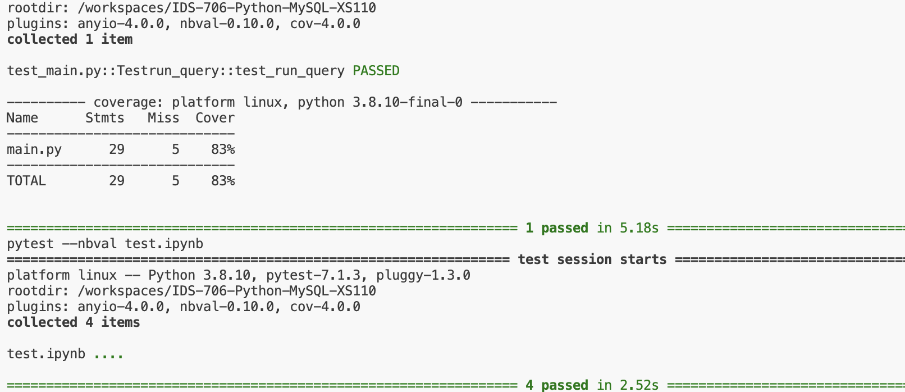
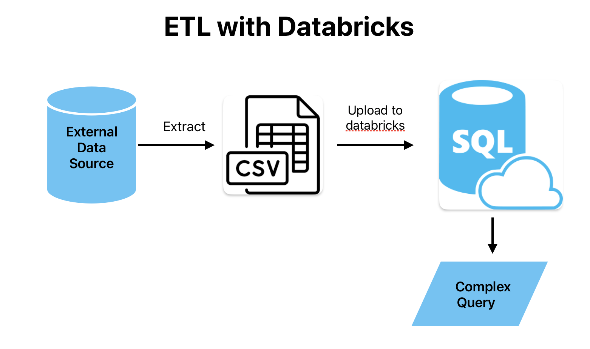

# Data Pipeline with Databricks

This project is about how to create and deploy an end-to-end data processing pipeline, including how to ingest raw data, transform the data, and run analyses on the processed data. The dataset used in this project is a subset of the Million Song Dataset, a collection of features and metadata for contemporary music tracks. This dataset is available in the sample datasets included in the Databricks workspace(DBFS).

## Step 1: Create a cluster

In the compute module, I created the `IDS706 cluster`,


## Step 2: Create ETL Notebook in Databricks

To perform an extract, transform, and load (ETL) workflow, I created 3 notebooks,

- Create a Databricks notebook `Ingest song data` to ingest raw source data and write the raw data to a target table.
``` python
from pyspark.sql.types import DoubleType, IntegerType, StringType, StructType, StructField

# Define variables used in the code below
file_path = "/databricks-datasets/songs/data-001/"
table_name = "raw_song_data" # Replace "your_table_name" with the desired table name
checkpoint_path = "/tmp/pipeline_get_started/_checkpoint/songss_data"

schema = StructType(
  [
    StructField("artist_id", StringType(), True),
    StructField("artist_lat", DoubleType(), True),
    StructField("artist_long", DoubleType(), True),
    StructField("artist_location", StringType(), True),
    StructField("artist_name", StringType(), True),
    StructField("duration", DoubleType(), True),
    StructField("end_of_fade_in", DoubleType(), True),
    StructField("key", IntegerType(), True),
    StructField("key_confidence", DoubleType(), True),
    StructField("loudness", DoubleType(), True),
    StructField("release", StringType(), True),
    StructField("song_hotnes", DoubleType(), True),
    StructField("song_id", StringType(), True),
    StructField("start_of_fade_out", DoubleType(), True),
    StructField("tempo", DoubleType(), True),
    StructField("time_signature", DoubleType(), True),
    StructField("time_signature_confidence", DoubleType(), True),
    StructField("title", StringType(), True),
    StructField("year", IntegerType(), True),
    StructField("partial_sequence", IntegerType(), True)
  ]
)

(spark.readStream
  .format("cloudFiles")
  .schema(schema)
  .option("cloudFiles.format", "csv")
  .option("sep","\t")
  .load(file_path)
  .writeStream
  .option("checkpointLocation", checkpoint_path)
  .trigger(availableNow=True)
  .toTable(table_name)
)
```
- Create a Databricks notebook `Prepare song data`to transform the raw source data and write the transformed data to a target table. This is my data sink.
```sql
%sql
CREATE OR REPLACE TABLE
  Prepare_songs_data (
    artist_id STRING,
    artist_name STRING,
    duration DOUBLE,
    release STRING,
    tempo DOUBLE,
    time_signature DOUBLE,
    title STRING,
    year DOUBLE,
    processed_time TIMESTAMP
  );

INSERT INTO
  Prepare_songs_data
SELECT
  artist_id,
  artist_name,
  duration,
  release,
  tempo,
  time_signature,
  title,
  year,
  current_timestamp()
FROM
  raw_song_data
```

- Create a Databricks notebook to query the transformed data.

```sql
%sql
-- Which artists released the most songs each year?
SELECT
  artist_name,
  count(artist_name)
AS
  num_songs,
  year
FROM
  prepare_songs_data
WHERE
  year > 0
GROUP BY
  artist_name,
  year
ORDER BY
  num_songs DESC,
  year DESC;

 -- Find songs for your DJ list
 SELECT
   artist_name,
   title,
   tempo
 FROM
   prepare_songs_data
 WHERE
   time_signature = 4
   AND
   tempo between 100 and 140;
```




## Step 3: Create a Databricks job to run the pipeline

To automate the data pipeline with a Databricks job, I created this `Songs_workflow`



### 3.Update main.py

I updated the main.py using  the Databricks SQL Connector for Python. I have uploaded two csv files to the databricks SQL warehouse, customers.csv and orders.csv. I used Databricks SQL Connector for Python to run a complex SQL query involving joins, aggregation, and sorting.


Here is the specific function:

```python
def run_query():
    try:
        # Replace with your environment variables or provide the actual values
        server_hostname = os.getenv("DATABRICKS_HOST")
        http_path = os.getenv("DATABRICKS_HTTP_PATH")
        access_token = os.getenv("DATABRICKS_TOKEN")

        # Establish a connection
        with sql.connect(
            server_hostname=server_hostname,
            http_path=http_path,
            access_token=access_token
        ) as connection:
            # Create a cursor
            with connection.cursor() as cursor:
                # Define the SQL query
                sql_query = """
                SELECT customerName, COUNT(O.orderNumber) as orderNum
                FROM customers AS C
                LEFT JOIN orders AS O ON C.customerNumber = O.customerNumber
                GROUP BY customerName
                HAVING customerName IS NOT NULL
                ORDER BY orderNum DESC
                LIMIT 10
                """
                # Execute the query
                cursor.execute(sql_query)

                # Fetch the result
                result = cursor.fetchall()


                # Print the result as a table
                headers = ["Customer Name", "Order Number"]
                table = tabulate(result, headers=headers, tablefmt="pretty")
                print(table)
                print("Query execution completed.")
    except Exception as e:
        print(f"Error: {e}")

    finally:
        try:
            # Close cursor and connection
            cursor.close()
            connection.close()
            print("Connection closed.")
        except NameError:
            # Handle the case where the cursor or connection was not defined
            pass

```
## Explanation

This query joined two tables: orders and customers on custermer id, then  retrieved each customer's order count, ordering the results by the count of orders in descending order, finally, limiting the results to the Top 10 most order customers.


## Results

[](https://github.com/nogibjj/IDS-706-Python-MYSQL-XS110/actions/workflows/cicd.yml)


### 1. successful database operations



### 2. passed all tests


### 3. flowchart

